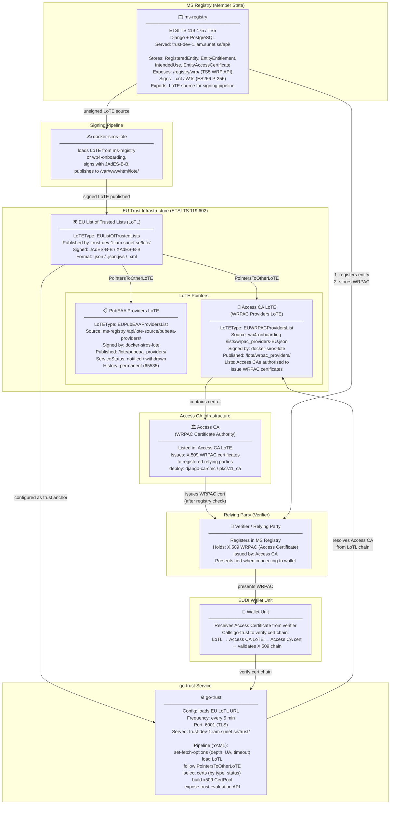
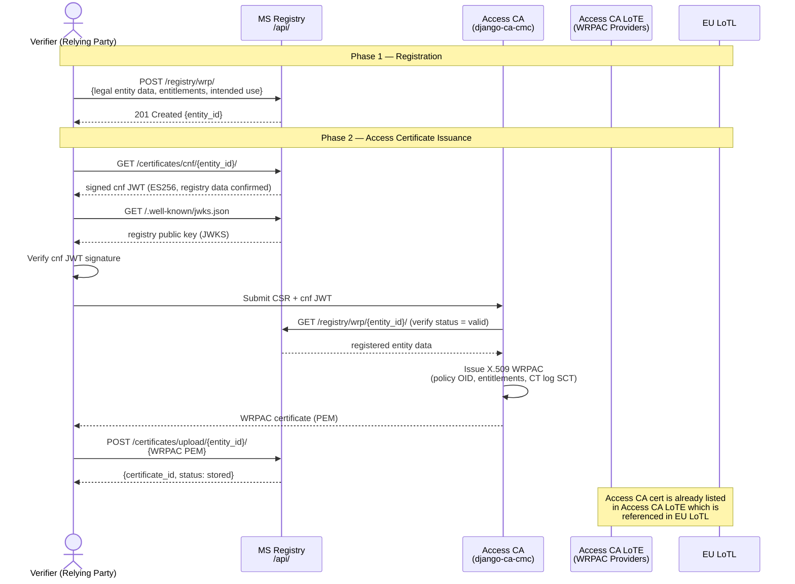
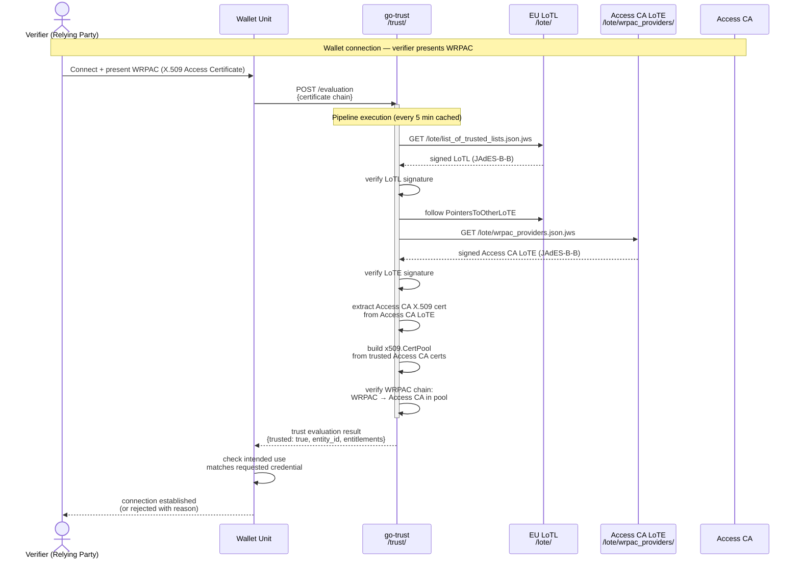
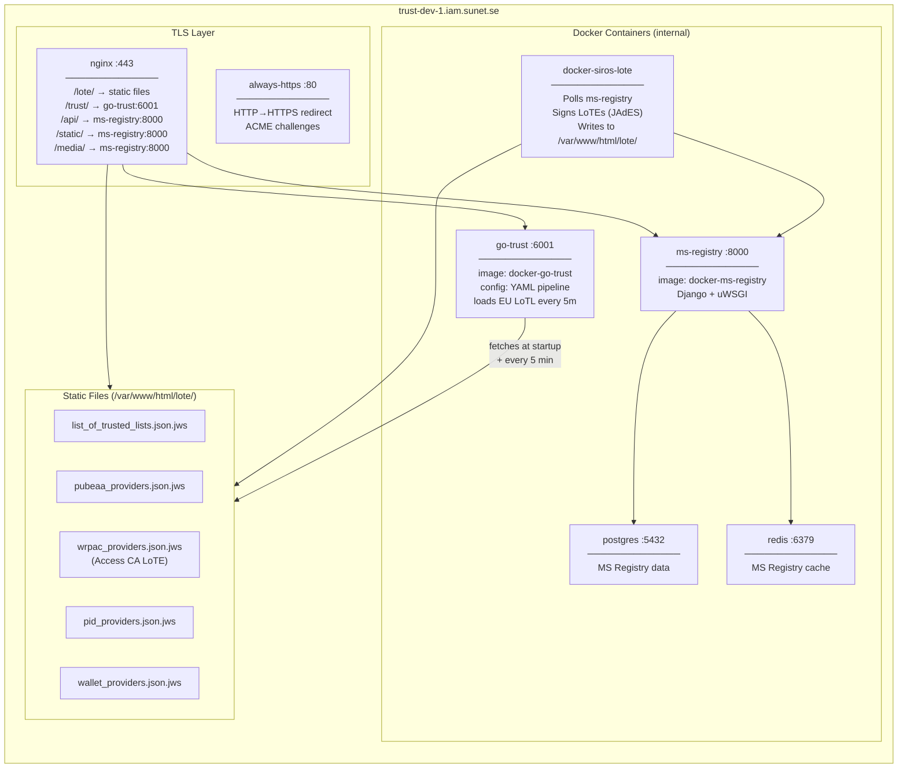
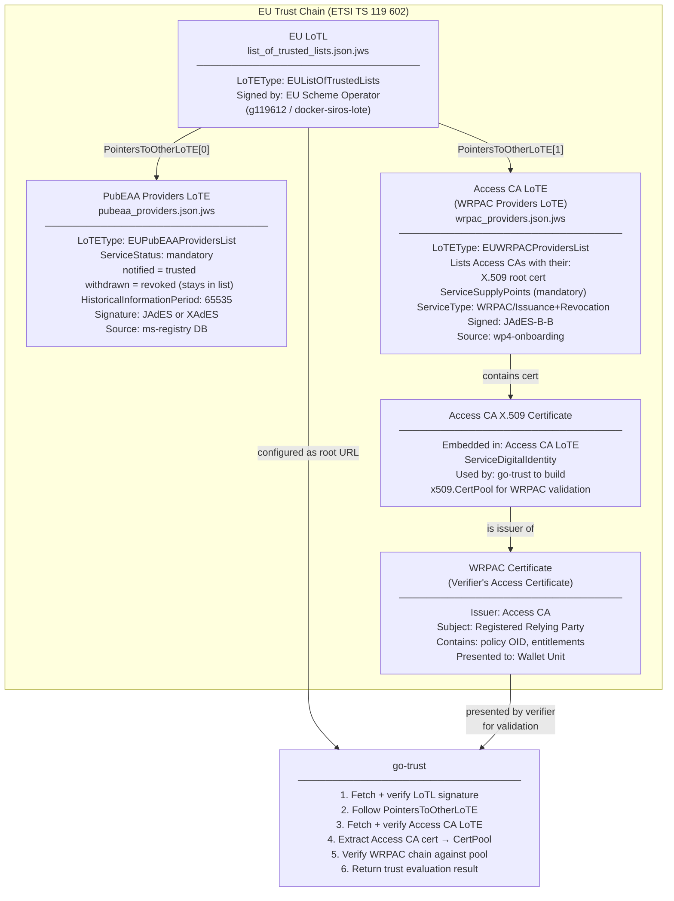

# WP4Trust Architecture — Mermaid Schema

## 1. Trust Infrastructure Overview

---

## 2. Verifier Registration & Certificate Issuance Flow

---

## 3. Wallet Connection & Certificate Verification Flow

---

## 4. Component Deployment Map

---

## 5. LoTL → LoTE Trust Chain Detail

